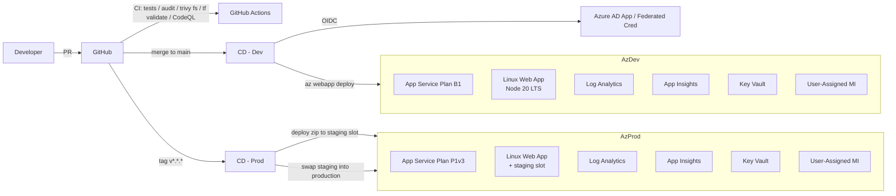

# Platform Engineering — Brasov Sunset API

End-to-end platform design for shipping `App/` to **Azure App Service** (Linux, Node.js 20 LTS) using Terraform and GitHub Actions, with no container build pipeline.

## Goals

- Reproducible infrastructure (no click-ops).
- Zero long-lived cloud credentials in CI (GitHub OIDC → Azure AD federated identity).
- Code-based zip deployment (no Docker, no registry to manage).
- Fast feedback (CI under 5 min), gated promotion to prod via slot swap.
- Operational visibility (logs, metrics, traces, availability tests).

## High-level architecture

## Component map

| Concern | Choice | Why |
|---|---|---|
| Compute | **Azure App Service** Linux (Node 20 LTS) | First-class Node.js PaaS; built-in health probes, slot swaps, autoscale, deployment center. No container build pipeline to maintain. |
| Plan SKU | **B1** dev / **P1v3** prod | B1 is cheap and supports `WEBSITE_RUN_FROM_PACKAGE`; P1v3 enables `always_on`, autoscale, and slots. |
| Deployment | **Zip + `WEBSITE_RUN_FROM_PACKAGE=1`** via `az webapp deploy` | Atomic, immutable, instant rollback by re-deploying the previous zip; no read-write filesystem coupling. |
| Promotion | **Deployment slot swap** (prod only) | Zero-downtime: deploy to `staging`, smoke test, swap into production. |
| IaC | **Terraform** (azurerm v4 + azuread v3) | Mature, broad ecosystem (tflint, checkov), team-standard. |
| State | **Azure Storage** with versioning + soft-delete + GRS | OIDC + Azure AD auth, blob lease for state locking. |
| Identity | **GitHub OIDC → AAD App** + **User-Assigned MI** | No client secrets; least-privilege role assignments per env. |
| Secrets | **Key Vault** (RBAC), referenced via App Settings `@Microsoft.KeyVault(...)` | No plaintext secrets in env vars or repo. |
| CI/CD | **GitHub Actions** | Native OIDC, broad action ecosystem, integrates with code scanning. |
| SAST | **CodeQL** | Native, zero-config JS analysis. |
| Dep scan | **npm audit + Dependabot + Trivy fs** | Catches lockfile, transitive, and OS-level deps. |
| Observability | **Log Analytics + Application Insights** auto-injected via App Settings | Logs, metrics, distributed tracing, availability web tests. |

## Environments

| Property | dev | prod |
|---|---|---|
| App Service SKU | B1 | P1v3 |
| Always On | off | on |
| Deployment slots | none | `staging` (swap to prod) |
| KV purge protection | off | on |
| Log retention | 30 days | 90 days |
| Trigger | push to `main` | tag `v*.*.*` (manual approval) |

## Pipeline overview

| Workflow | Trigger | Purpose |
|---|---|---|
| `ci.yml` | PR + push | Tests + coverage, npm audit, Trivy fs, terraform fmt/validate/tflint/Checkov |
| `codeql.yml` | PR + push + weekly | JavaScript SAST |
| `cd-dev.yml` | push to `main` | Build zip → terraform apply (dev) → `az webapp deploy` → smoke test |
| `cd-prod.yml` | tag `v*.*.*` | Build zip → terraform apply (prod) → deploy to staging slot → smoke → slot swap → smoke |
| `release.yml` | tag `v*.*.*` | GitHub Release with auto changelog |

## Required GitHub secrets

| Secret | Source | Notes |
|---|---|---|
| `AZURE_CLIENT_ID` | bootstrap output `github_oidc_client_id` | OIDC App registration |
| `AZURE_TENANT_ID` | bootstrap output | |
| `AZURE_SUBSCRIPTION_ID` | bootstrap output | |
| `TFSTATE_RG` | bootstrap output `tfstate_resource_group` | |
| `TFSTATE_STORAGE` | bootstrap output `tfstate_storage_account` | |

## Required GitHub environments

- **dev** — no manual approval; deploys on push to `main`.
- **prod** — required reviewers (1+), wait timer optional, deployment branch rule: tags matching `v*.*.*` only.

## Branch protection (recommended)

On `main`:
- Require PR review (1+).
- Require status checks: `app-test`, `npm-audit`, `trivy-fs`, `terraform (dev)`, `terraform (prod)`, `Analyze JavaScript`.
- Require linear history.
- Require signed commits.
- Disallow force-push.
- Block secrets via push protection (Advanced Security).

## Security model

- **No long-lived credentials**: GitHub federated to Azure AD; web app reads Key Vault via Managed Identity.
- **Least privilege**: deployer SP scoped to subscription Contributor + User Access Administrator (needed to create role assignments inside envs); per-env RG ownership; runtime MI has only Key Vault Secrets User and Reader on its RG.
- **Transport**: HTTPS only, TLS 1.2 minimum, FTPS disabled, HTTP/2 enabled.
- **Network**: public ingress only (App Service managed cert). Private endpoints / VNet integration are documented as next step.

## Cost guardrails

- dev runs on B1 (~ €13/month) without `always_on`; idle pricing dominated by App Service Plan + Log Analytics.
- prod on P1v3 (~ €70/month) with one staging slot included.
- Log retention deliberately bounded (30/90 days).

## What is intentionally NOT included (and why)

- **Containers / ACR / image signing**: explicitly removed — code-based PaaS is the simpler fit for a stateless Node.js API. No registry, no Dockerfile, no Trivy image scan.
- **AKS / Container Apps / Service Mesh**: overkill.
- **VNet integration + private endpoints (ACR/KV/App Service)**: meaningful hardening but adds cost and complexity. Documented as next step.
- **Custom domain + Front Door**: app exposes a managed `*.azurewebsites.net` HTTPS URL by default; add custom domain per environment when needed.
- **GitOps (Flux/Argo)**: deployments are managed declaratively via Terraform + `az webapp deploy`.
