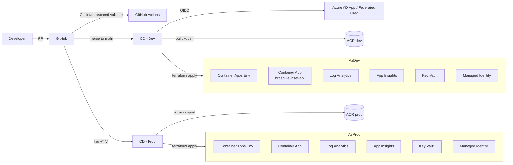

# Platform Engineering — Brasov Sunset API

End-to-end platform design for shipping `App/` to Azure with Terraform, GitHub Actions, and supply-chain controls.

## Goals

- Reproducible infrastructure (no click-ops).
- Zero long-lived cloud credentials in CI (GitHub OIDC → Azure AD).
- Signed, scanned, attested container images.
- Fast feedback (CI under 5 min), gated promotion to prod.
- Operational visibility (logs, metrics, traces, availability tests).

## High-level architecture

## Component map

| Concern | Choice | Why |
|---|---|---|
| Compute | **Azure Container Apps** | Serverless containers, scale-to-zero, native HTTPS ingress, revisions, KEDA scalers, native Log Analytics + App Insights. Right-sized for a small Node.js API; AKS would be overkill. |
| Image registry | **Azure Container Registry** (Standard dev / Premium prod) | OIDC-friendly, AcrPull via managed identity, `az acr import` for promotion, geo-replication + content trust on Premium. |
| IaC | **Terraform** (azurerm v4 + azuread v3) | Mature provider, broad ecosystem (tflint, checkov), team-standard. |
| State | **Azure Storage** with versioning + soft-delete + blob lease locking | No external dependency; OIDC + Azure AD auth, no shared keys in CI. |
| Identity | **GitHub OIDC → AAD App** + **User-Assigned MI** for runtime | No client secrets; least-privilege role assignments per env. |
| Secrets | **Key Vault** (RBAC) referenced via Container App `secretRef` / managed identity | No plaintext secrets in env vars or repo. |
| CI/CD | **GitHub Actions** | Native OIDC, broad action ecosystem, integrates with code scanning. |
| SAST | **CodeQL** | Native, free for public/private with Advanced Security. |
| Dep scan | **npm audit + Dependabot + Trivy fs** | Catches lockfile, transitive, and OS-level deps. |
| Image scan | **Trivy** (PR + post-push) | Blocks HIGH/CRITICAL CVEs. |
| Supply chain | **cosign** keyless signing + SPDX SBOM (syft) attached as attestation | Verifiable provenance, prod gate verifies signature. |
| Observability | **Log Analytics + Application Insights** auto-injected via env var | Logs, metrics, distributed tracing, availability web tests. |

## Environments

| | dev | prod |
|---|---|---|
| Min replicas | 0 (scale-to-zero) | 1 |
| Max replicas | 3 | 10 |
| CPU / mem | 0.25 / 0.5Gi | 0.5 / 1Gi |
| ACR SKU | Standard | Premium |
| KV purge protection | off | on |
| Log retention | 30 days | 90 days |
| Trigger | push to `main` | tag `v*.*.*` (manual approval) |

## Pipeline overview

| Workflow | Trigger | Purpose |
|---|---|---|
| `ci.yml` | PR + push | Tests + coverage, npm audit, Trivy fs, docker build, terraform fmt/validate/tflint, Checkov |
| `codeql.yml` | PR + push + weekly | JavaScript SAST |
| `cd-dev.yml` | push to `main` | Build, scan, sign, push, SBOM, terraform apply (dev), revision update, smoke test |
| `cd-prod.yml` | tag `v*.*.*` | `az acr import` from dev, cosign verify, terraform apply (prod), revision update, smoke test |
| `release.yml` | tag `v*.*.*` | GitHub Release with auto changelog |

## Required GitHub secrets

| Secret | Source | Notes |
|---|---|---|
| `AZURE_CLIENT_ID` | bootstrap output `github_oidc_client_id` | OIDC App registration |
| `AZURE_TENANT_ID` | bootstrap output | |
| `AZURE_SUBSCRIPTION_ID` | bootstrap output | |
| `TFSTATE_RG` | bootstrap output `tfstate_resource_group` | |
| `TFSTATE_STORAGE` | bootstrap output `tfstate_storage_account` | |

## Required GitHub environments

Create two GitHub Environments and attach protection rules:

- **dev** — no manual approval, deploys on push to `main`.
- **prod** — required reviewers (1+), wait timer optional, deployment branch rule: tags matching `v*.*.*` only.

## Branch protection (recommended)

On `main`:
- Require PR review (1+).
- Require status checks: `app-test`, `npm-audit`, `trivy-fs`, `docker-build`, `terraform (dev)`, `terraform (prod)`, `Analyze JavaScript`.
- Require linear history.
- Require signed commits.
- Disallow force-push.
- Block secrets via push protection (Advanced Security).

## Security model

- **No long-lived credentials**: GitHub federated to Azure AD, Container App pulls ACR via Managed Identity, reads Key Vault via Managed Identity.
- **Least privilege**: deployer SP scoped to subscription Contributor + UAA (needed for role assignments inside envs); per-env RG ownership; runtime MI has only AcrPull + KV Secrets User.
- **Image trust**: every prod-bound image is verified against a cosign signature issued by the dev pipeline (`cosign verify` step).
- **Network**: public ingress only (Container Apps managed cert). Private endpoints for ACR/KV are out-of-scope here but documented as next step.

## Cost guardrails

- dev scales to zero — idle cost ≈ Log Analytics + ACR storage (~ a few €/month).
- prod min replicas = 1, vCPU 0.5; expect single-digit € for low traffic.
- Log retention deliberately bounded (30/90 days).

## What is intentionally NOT included (and why)

- **AKS / Service Mesh**: overkill for a single stateless API.
- **Private endpoints / VNet integration**: meaningful but adds cost and operational complexity. Documented as "next step" rather than wired in.
- **Custom domain + Front Door**: app exposes a managed `*.azurecontainerapps.io` HTTPS URL by default; add custom domain per environment when needed.
- **GitOps (Flux/Argo)**: revisions are managed declaratively via Terraform + `az containerapp update`; GitOps would not earn its complexity here.
